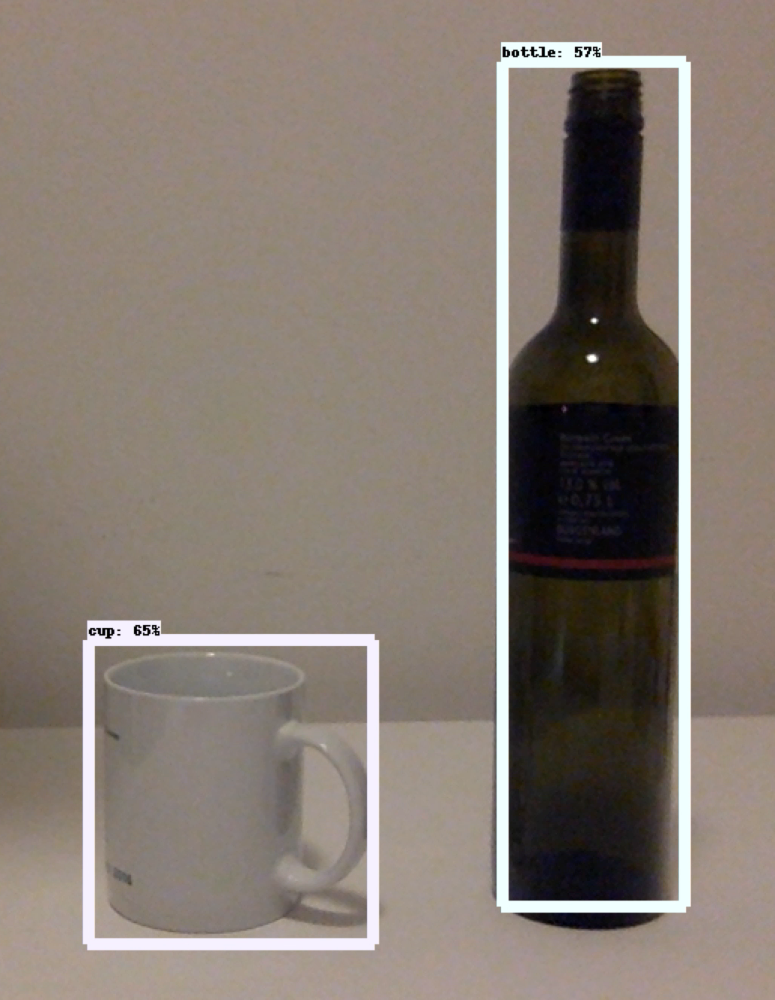

# obj_detec_tf2api_rt

 

This code deploys tensor flow 2's object detection api to identify objects in realtime. Please keep in mind that, given your computer's hardware, there will probably be sum limits as to what models you can run.

Before executing main.py make sure you installed all the required files by running the bash commands in setup.sh.

<em><strong>Disclaimer:</strong>This code only works on Linux/MacOS.</em>

